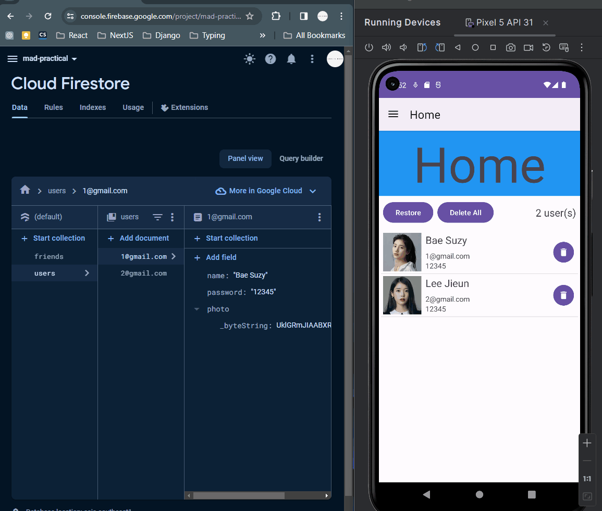

# Demo

# Instruction
1. Login Firebase
2. Connect Firebase
Tools > Firebase> Cloud Firestore > Getting Started with cloud firestore > Connect > Select a project

Swap to project view > app > google-services.json

3. Run App
3.5 Restore , will delete everything , have two hard core value
4. Register a new user 3@gmail.com, five character password, drag photo select photo
Data.kt -> Data model
UserVM.kt > CRUD

# Extra Information
AndroidViewModel(vs ViewModel) allow to pass the app to allow use to access context > resource

view is a div

view > tool window > device explorer > data > data > com.example.demo > AUTH.xml

To clear the history stack, so that when user log out ( or being deleted), it cannot access page 3 and 4 which are only can be accessed by the authenticate user

